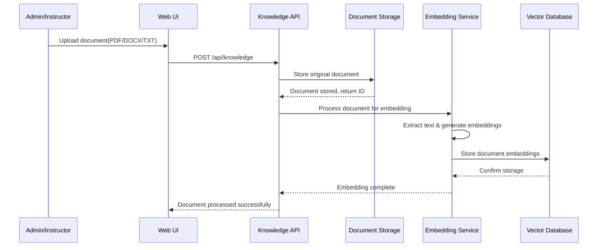
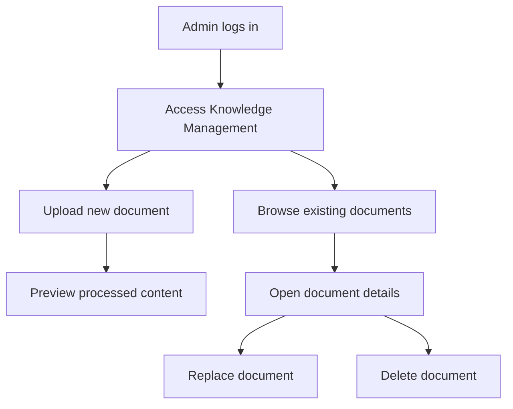

# Knowledge Management System TDD

## Key Components

- **Document Storage Service**: Handles file uploads and storage of various document formats
- **Embedding Service**: Processes documents and generates vector embeddings for semantic search
- **Vector Database**: Stores document embeddings for efficient semantic retrieval
- **Knowledge API**: Exposes endpoints for CRUD operations on knowledge documents

## Technical Flow Diagram

## User Flow Diagram

