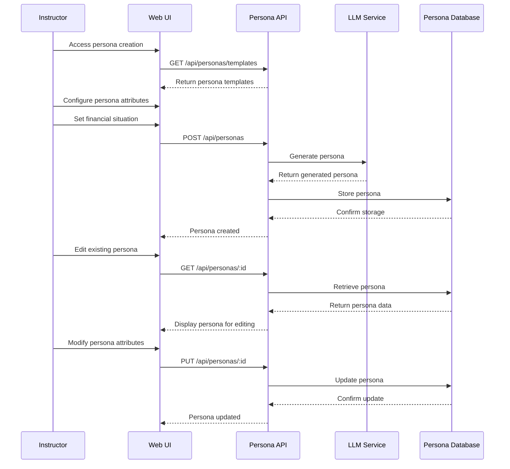
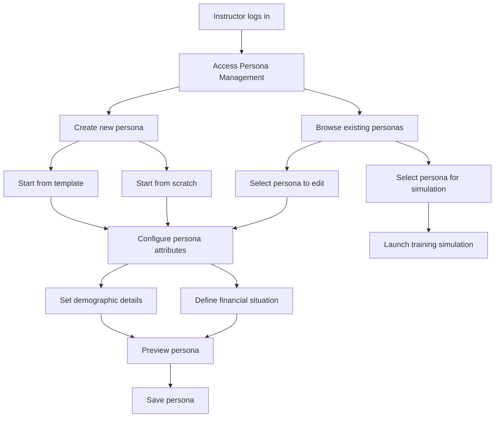

# AI Persona Engine TDD

## Goal
The AI Persona Engine is designed to simulate client status and goals, such that their problems and desires are exposed.

## Key Components

- **Persona Generator**: Creates realistic financial customer personas using LLM with Consultation Data and Knowledge Base
- **Persona Configuration Manager**: UI for customizing persona attributes and financial scenarios
- **Financial Scenario Generator**: Creates realistic financial situations for personas
- **Persona Database**: Stores created personas for reuse in training sessions
- **Persona API**: Exposes endpoints for CRUD operations on personas

## Technical Flow Diagram

## User Flow Diagram

