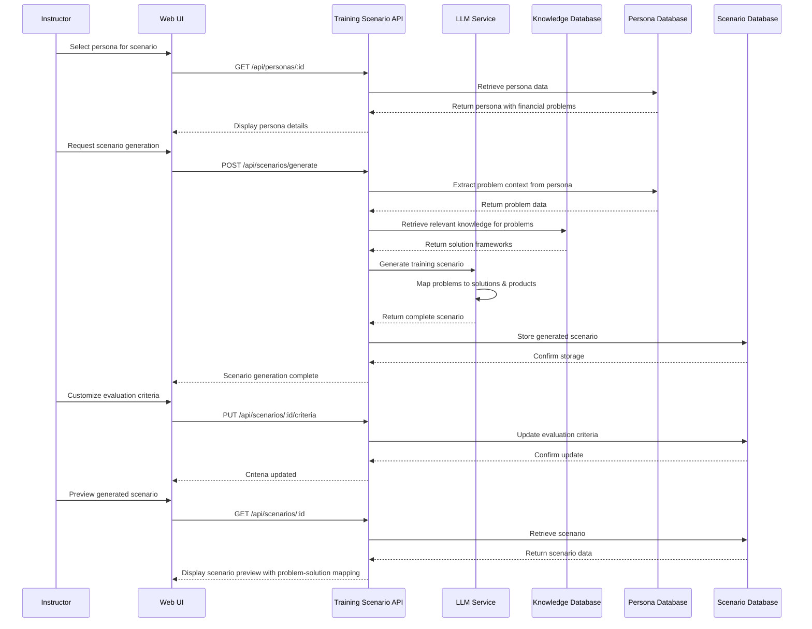
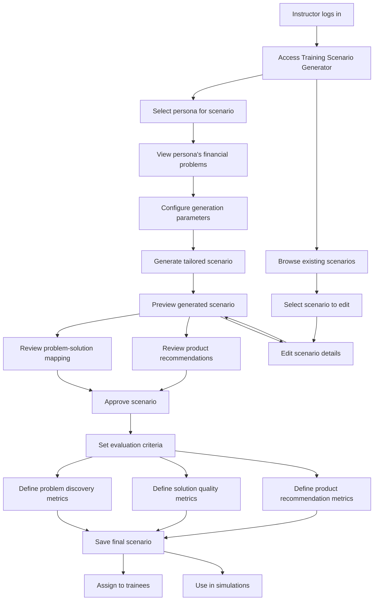

# AI-Driven Training Scenario Generator TDD

## Goal
Based on personas and Knowledge base, generate relevant scenarios (solution to customer problems) and appropriate products & services. Such that in the training session, trainee is tested on whether they can discover the problems and provide solutions effectively. 

## Key Components

- **Content Analyzer**: Extracts key concepts and knowledge points from knowledge base documents
- **Case Study Generator**: Builds realistic financial scenarios for application testing
- **Problem-Solution Mapper**: Maps persona financial problems to appropriate solution frameworks
- **Product Recommendation Engine**: Identifies suitable financial products for scenario problems
- **Evaluation Criteria Generator**: Develops scoring rubrics for trainee assessment
- **Training Scenario API**: Exposes endpoints for generating and managing training scenarios
- **Training Scenario Database**: Stores generated training scenarios and evaluation criteria

## Training Scenario Structure

Each generated training scenario contains:

1. **Customer Context**: Background information derived from persona
2. **Hidden Financial Problems**: Issues that the trainee must identify through conversation
3. **Solution Frameworks**: Knowledge-appropriate responses to the identified problems
4. **Recommended Products/Services**: Suitable offerings that address the customer's needs
5. **Success Metrics**: Criteria for evaluating trainee performance in problem discovery and solution recommendation

## Technical Flow Diagram



## User Flow Diagram



## Problem-Solution Mapping Example

```
{
  "scenario": "Retirement Planning for Small Business Owner",
  "customer_context": {
    "derived_from_persona": "Small Business Owner, age 58",
    "business_details": "Family-owned retail business for 30 years",
    "personal_situation": "Married, spouse with chronic health condition"
  },
  "financial_problems": [
    {
      "problem_id": "P1",
      "problem": "Business succession planning unclear",
      "discovery_hints": ["Asked about children in business", "Mentioned retirement timeline"],
      "difficulty": "Medium"
    },
    {
      "problem_id": "P2",
      "problem": "Inadequate retirement savings outside of business",
      "discovery_hints": ["Asked about investment accounts", "Inquired about savings rate"],
      "difficulty": "Hard"
    },
    {
      "problem_id": "P3",
      "problem": "Healthcare costs for spouse",
      "discovery_hints": ["Asked about family health", "Inquired about insurance"],
      "difficulty": "Easy"
    }
  ],
  "solution_frameworks": [
    {
      "for_problem": "P1",
      "knowledge_areas": ["Business Succession", "Estate Planning"],
      "key_points": [
        "Family transition vs. external sale options",
        "Business valuation considerations",
        "Tax implications of different succession strategies"
      ]
    },
    {
      "for_problem": "P2",
      "knowledge_areas": ["Retirement Planning", "Investment Strategy"],
      "key_points": [
        "Catch-up contribution strategies",
        "Risk assessment for shortened timeline",
        "Social Security optimization tactics"
      ]
    },
    {
      "for_problem": "P3",
      "knowledge_areas": ["Healthcare Planning", "Insurance"],
      "key_points": [
        "Long-term care insurance options",
        "Medicare supplement considerations",
        "Health savings account strategies"
      ]
    }
  ],
  "product_recommendations": [
    {
      "for_problem": "P1",
      "products": [
        "Business succession planning service",
        "Buy-sell agreement review",
        "Estate planning legal service referral"
      ]
    },
    {
      "for_problem": "P2",
      "products": [
        "Self-employed 401(k)",
        "High-yield dividend portfolio",
        "Annuity for guaranteed income"
      ]
    },
    {
      "for_problem": "P3",
      "products": [
        "Long-term care insurance",
        "Medicare supplement plan",
        "Health savings account"
      ]
    }
  ],
  "evaluation_criteria": {
    "problem_discovery": {
      "criteria": "Did trainee identify all three key problems?",
      "scoring": "1 point per problem discovered, bonus for sequence"
    },
    "solution_quality": {
      "criteria": "Did trainee apply correct knowledge to problems?",
      "scoring": "0-5 scale per solution based on knowledge application"
    },
    "product_recommendation": {
      "criteria": "Did trainee recommend appropriate products?",
      "scoring": "1 point per appropriate product, -1 for inappropriate"
    }
  }
}
```