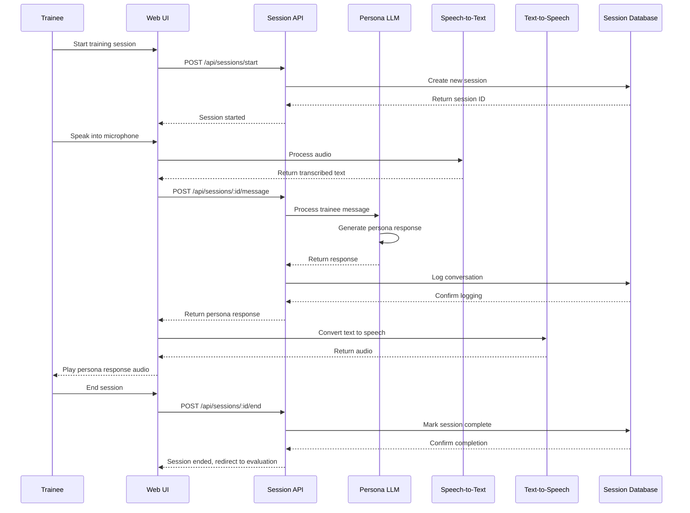
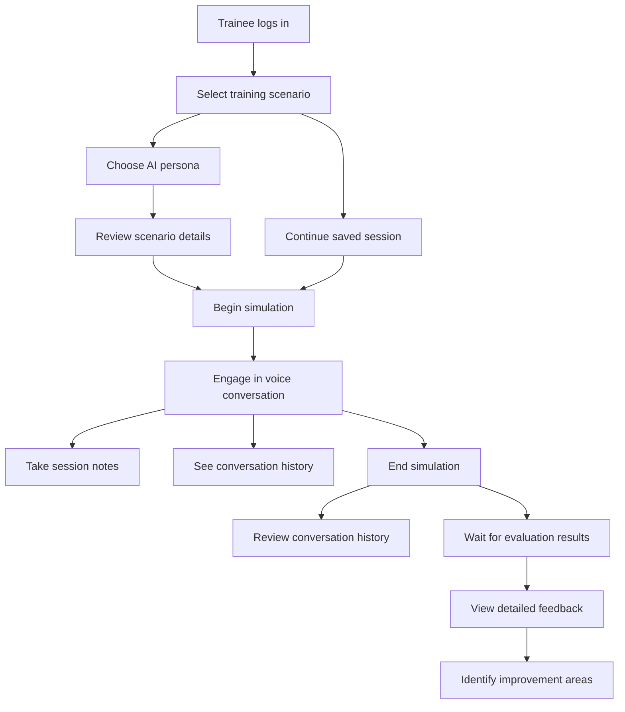

# Chat Simulation Platform TDD

## Key Components

- **Session Manager**: Handles creation and management of simulation sessions
- **Audio Interface**: Provides speech-to-text and text-to-speech capabilities
- **Chat Service**: Manages real-time messaging between trainee and AI persona
- **Conversation Logger**: Records and stores conversation history
- **Scenario Manager**: Controls progression of financial scenarios during simulation
- **Session API**: Exposes endpoints for managing simulation sessions

## Technical Flow Diagram

## User Flow Diagram

