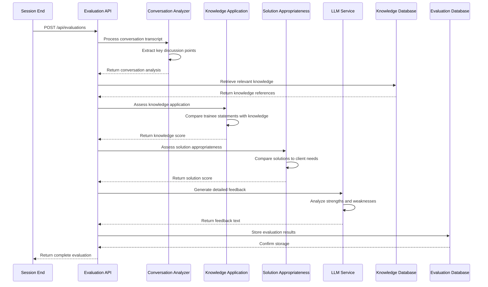
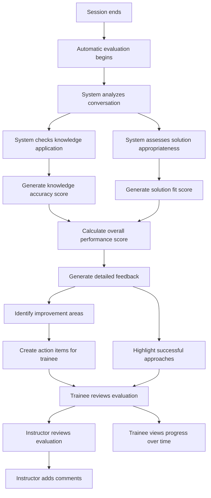

# Evaluation Engine TDD

## Key Components

- **Conversation Analyzer**: Processes conversation transcripts for analysis
- **Knowledge Application Checker**: Verifies if trainee applied relevant knowledge
- **Solution Appropriateness Evaluator**: Assesses if recommended solutions match client needs
- **Scoring Engine**: Calculates scores based on defined evaluation criteria
- **Feedback Generator**: Creates detailed, actionable feedback for trainees
- **Evaluation API**: Exposes endpoints for evaluation requests and results

## Technical Flow Diagram

## User Flow Diagram

