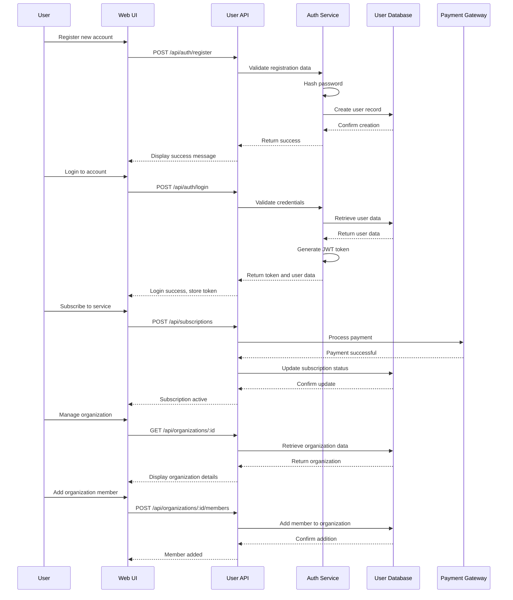
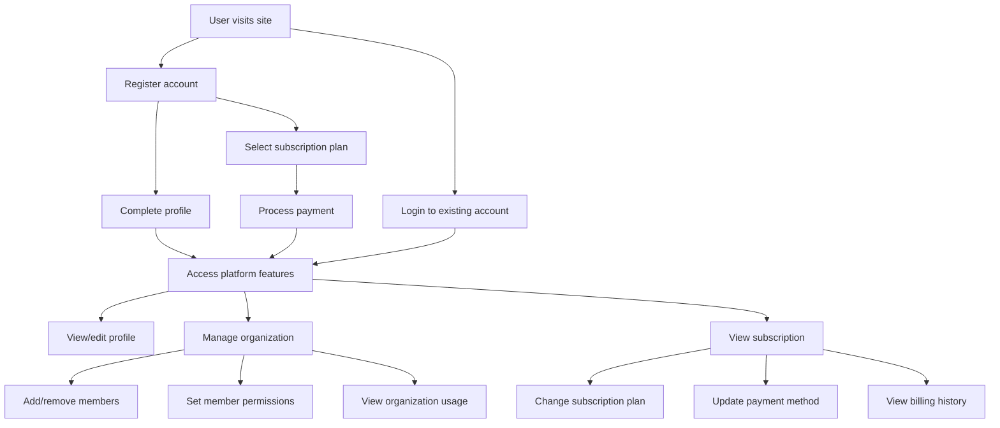

# User Management System TDD

## Key Components

- **Authentication Service**: Handles user login, registration, and authorization
- **User Profile Manager**: Manages user profile information and preferences
- **Role-Based Access Control**: Controls access to system features based on roles
- **Organization Manager**: Handles organization-level administration
- **Subscription Service**: Manages payment processing and subscription status
- **User API**: Exposes endpoints for user management operations

## Technical Flow Diagram

## User Flow Diagram

